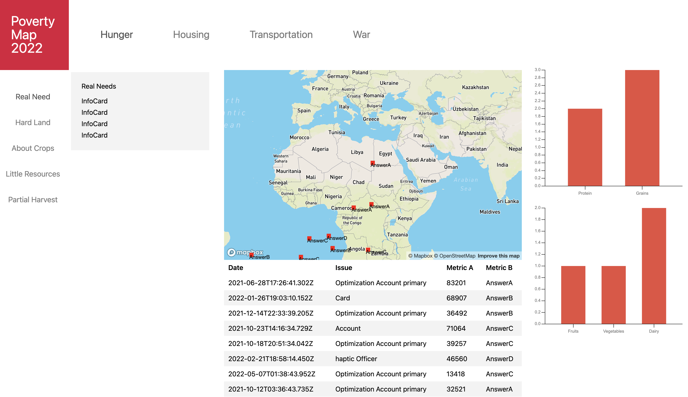

# Poverty Map 2022

<!--  -->

Poverty Map is about showing the entire context of major life-threatening and quality-of-life-altering crises around the world in an easy to understand format.

By distilling the context, such as what nutrition is required, where food is grown, how it's transported, and what it's sold for, and then displaying it via graphs, charts, and maps - we can shed light on the entire problem and help spur action around these immensely important issues.

## Getting Started

### Setup Enviornment

- Install the recomended VS Code extensions
- Enable Prettier as the Default Formatter
- Enable Format on Save

- `brew install volta`
- `yarn global add dotenv dotenv-cli`

- `volta install node`
- `volta install yarn`

### Start Monorepo

- `yarn setup`
- `yarn start`

### Setup poverty-map-client

- `yarn build`

## More Information

- `yarn plop` to generate empty components and hooks

### Lerna Commands

- `yarn bootstrap` or `lerna run start --stream` runs `yarn start` in all packages at once
- Use `lerna create` or `lerna add` to add new packages
- `lerna bootstrap` installs `node_modules` for all packages
- `lerna add eslint --scope=package*` will add eslint to package.jsons in all packages at once

### Packages

- Lerna
- Volta
- Plop.js
- Husky + Commitlint
- ESLint + Prettier

- Next.js SWR
- @react-three/fiber (three.js)
- AirBnB's @visx/visx (D3)

### References

- https://medium.com/rewrite-tech/how-to-create-a-monorepo-with-lerna-3ed6dfec5021
- https://errorfixer.co/fix-webgl-hit-snag-chrome-error/

### Inspiration

- Most similar but limited data set is https://hgis.uw.edu/refugee/index.html
  It goes through a series of maps (incl. https://hgis.uw.edu/refugee/context.html#)
  Shows a sequential journey https://hgis.uw.edu/refugee/journeys/index.html

- https://www.chpcny.org/makingneighborhoodsregional/#
- https://carto.com/blog/visualizing-health-data-social-factors/
- https://carto.com/blog/enveritas-coffee-poverty-visualization/
- https://carto.com//blog/demo/carto-now-available-for-deck-gl/
- https://carto.com/blog/look-back-18-months-covid-grants-maps/
